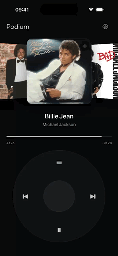
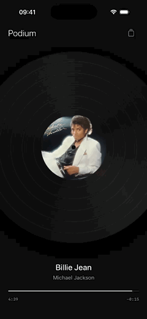

# Podium

A minimal click-wheel music player for iPhone that controls the Spotify app, written in SwiftUI.

<p align="center">
  
  &nbsp;&nbsp;
  
</p>

<p align="center"><a href="https://podium.inteliquest.pl">podium.inteliquest.pl</a></p>

## Features

- Ultra-minimal dark UI that fits on one screen
- Two styles, switched with the icon in the top-right corner:
  - a click wheel with a carousel of Spotify's recommended content and a now-playing indicator
  - a full-screen vinyl record that spins while playing, with the album art as its label and no on-screen buttons
- Home Screen and Lock Screen widgets: a small record, a medium record with the track and live progress, and circular, rectangular and inline Lock Screen styles
- Haptic feedback on the wheel and on record gestures
- Play/pause, previous/next and seeking with live playback progress
- Spotify App Remote connection: authorization, player state and controls
- Mock remote that simulates playback, so the UI runs in the Simulator without Spotify

## Requirements

- Xcode 26 (tested with 26.6)
- iOS 17+
- To connect to Spotify: an iPhone with the Spotify app and a Spotify Premium account (Spotify requires Premium for apps in Development Mode)

## Getting started

Open `Podium.xcodeproj`, pick an iPhone simulator and Run (⌘R). The Simulator uses the mock remote, so no setup is needed.

From the command line:

```bash
xcodebuild -project Podium.xcodeproj -scheme Podium -destination 'platform=iOS Simulator,name=iPhone 17 Pro' build
```

The Spotify iOS SDK (`SpotifyiOS`) is added through Swift Package Manager and resolved on the first build.

## Connecting to Spotify

1. Create an app at https://developer.spotify.com/dashboard and select **iOS** under APIs/SDKs.
2. Add the Redirect URI `podium-player://spotify-login-callback`, and your bundle ID under **iOS app bundles**.
3. Copy `Config/Secrets.example.xcconfig` to `Config/Secrets.xcconfig` and fill in `PODIUM_BUNDLE_ID`, `DEVELOPMENT_TEAM` and `SPOTIFY_CLIENT_ID`. Git ignores this file.
4. Connect your iPhone, turn on Developer Mode, and Run from Xcode.
5. Start playing something in Spotify, open Podium and tap **Connect**. Spotify opens to authorize and switches back.

Notes:

- Development Mode apps work for their owner plus up to 5 users added under User Management in the dashboard.
- With a free Apple developer account, apps installed on a device expire after 7 days; Run from Xcode again to reinstall.
- The access token is kept in memory only. After Podium is relaunched, tapping Connect authorizes again, which briefly opens Spotify and resumes playback.
- The Simulator always uses `MockSpotifyRemote`. Launch arguments `-PodiumRemote spotify` / `-PodiumRemote mock` override the choice.

## Widgets

Add them from the Home Screen or Lock Screen editor (search for Podium). The widgets show what Podium last reported: the app updates them when the track, pause state or position changes, and the progress bar advances on its own in between. Tapping a widget opens Podium.

The app and the widget extension share data through the app group `group.<PODIUM_BUNDLE_ID>`, which Xcode sets up automatically, also with a free Apple account.

## Controls

Both styles:

- Top-right icon: switch between the click wheel and the vinyl record
- Connect: connect to Spotify
- Drag the progress bar: seek

Click wheel:

- Rotate the wheel: browse the carousel
- Center button: play the browsed item (or play/pause if it is the one playing)
- Top of the wheel: jump back to what is playing
- Previous / next: change track (previous restarts the current track after 3 seconds)
- Bottom of the wheel: play / pause

Vinyl:

- Tap the record: play / pause
- Swipe left / right on the record: next / previous track

## Architecture

- `PlayerViewModel`: UI/player state; extrapolates playback progress between remote updates
- `SpotifyRemoteControlling`: transport abstraction (commands, connection state, `onStateChange` / `onLibraryChange`)
- `SpotifyRemoteManager`: App Remote implementation (authorization, player state, recommended content, artwork)
- `SpotifyConfiguration`: Client ID (from `Config/Secrets.xcconfig`) and redirect URL
- `PlayerState`: remote player snapshot (track, paused, position, context)
- `MockSpotifyRemote`: development implementation simulating a queue, playback and auto-advance
- `MockLibrary`: demo albums and tracks
- `ClickWheelView`: angular finger tracking + haptics
- `CoverFlowView`: carousel
- `VinylView`: spinning record with the album art as its label
- `ProgressViewBar`: scrubbing
- `PodiumPlayerView`: style toggle, click wheel layout and full-screen vinyl layout with record gestures
- `NowPlayingPublisher`: writes what's playing to the app group and reloads the widgets
- `Shared/NowPlayingStore`: now-playing snapshot and label artwork shared by the app and the widgets
- `PodiumWidgets`: widget extension (small, medium and Lock Screen widgets)

## Support

Podium is free and open source, and every feature is available to everyone. If you enjoy it, you can support its development on [Buy Me a Coffee](https://buymeacoffee.com/inteliquest). Support is voluntary and doesn't unlock anything in the app.

## Disclaimer

Podium is an independent project and is not affiliated with, endorsed or sponsored by Spotify or Apple. Spotify is a trademark of Spotify AB; iPhone is a trademark of Apple Inc.

The Spotify Developer Terms allow apps like this for personal, non-commercial use. Don't publish builds of Podium to the App Store, charge for them, or add payments or ads to the app.

## License

MIT — see [LICENSE](LICENSE).

Made by [Inteliquest](https://inteliquest.pl).
